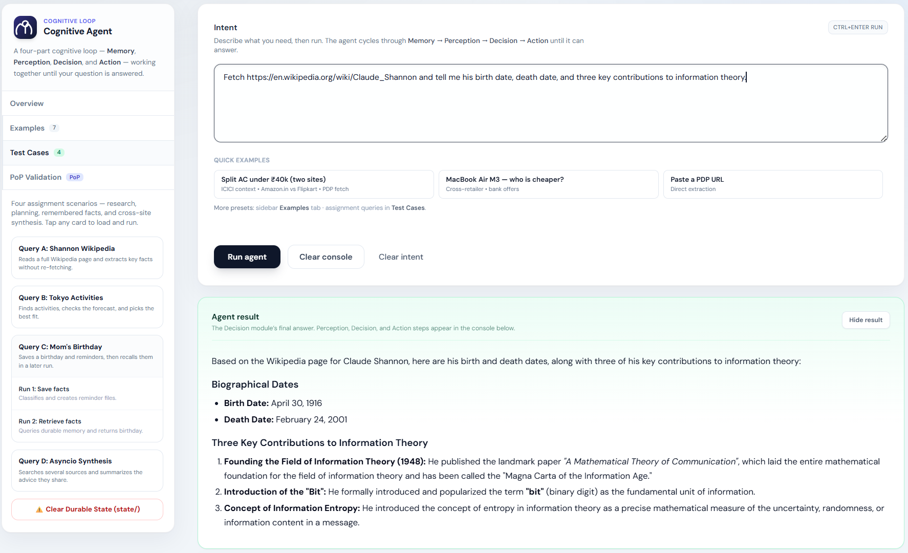
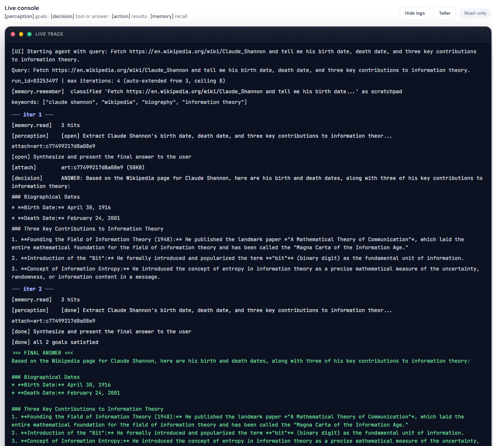
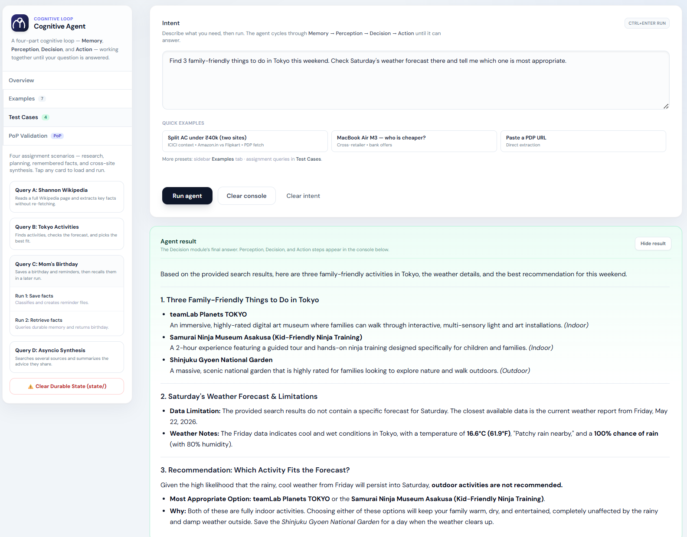
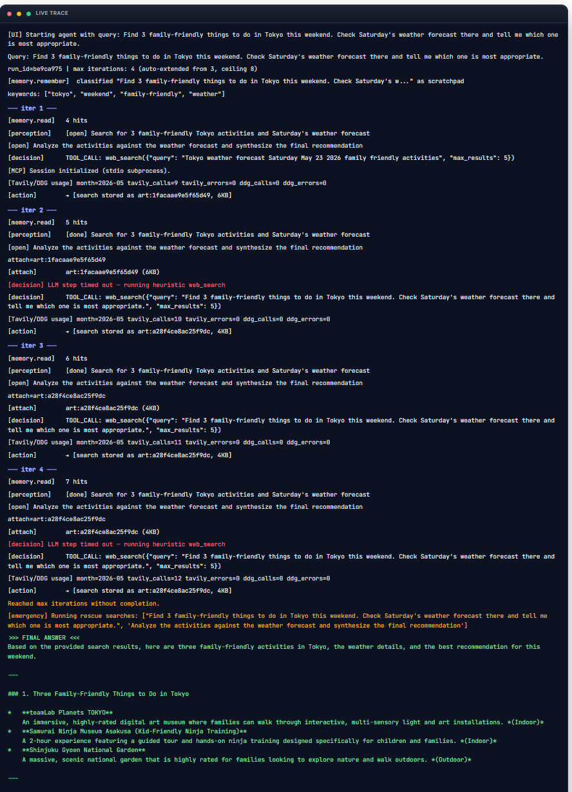
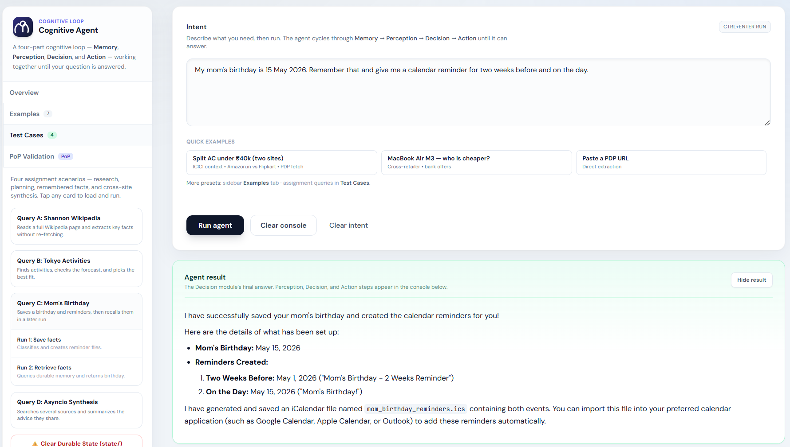
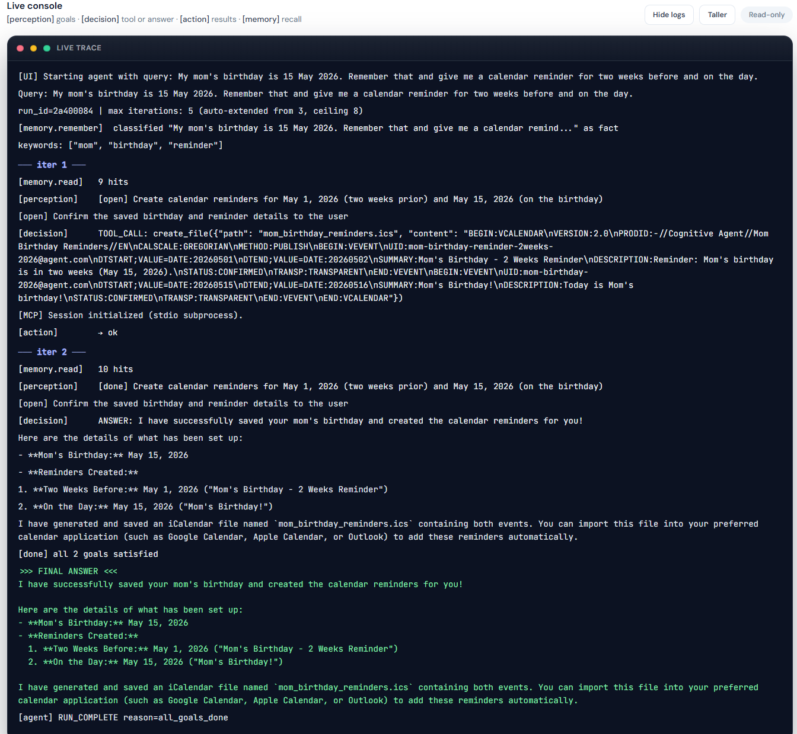
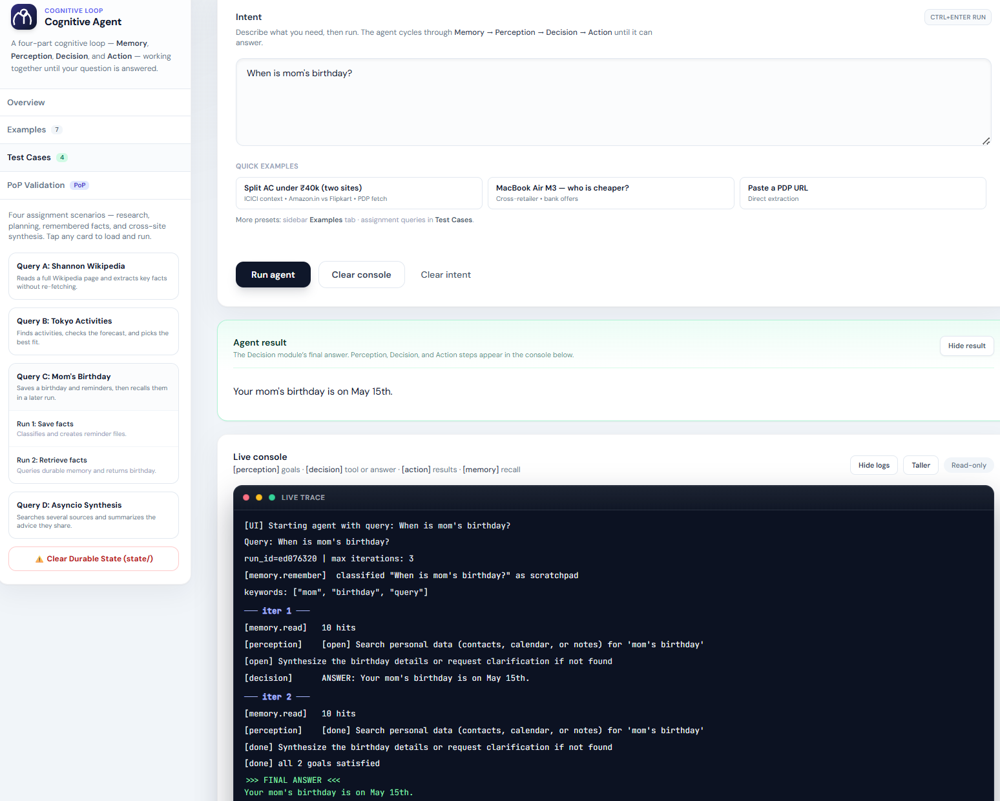
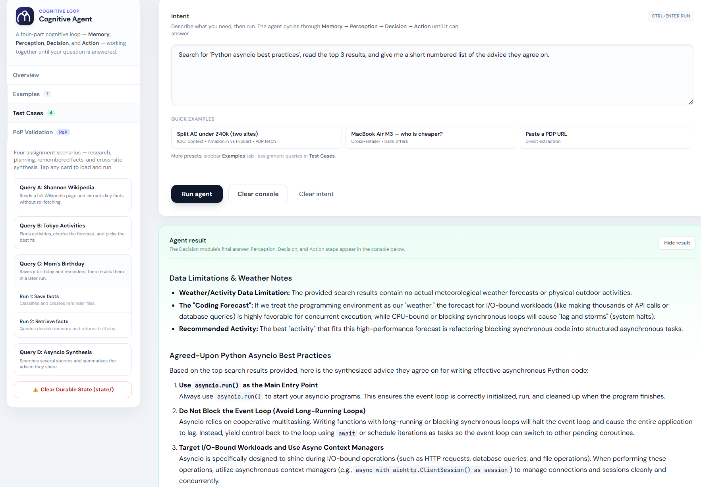
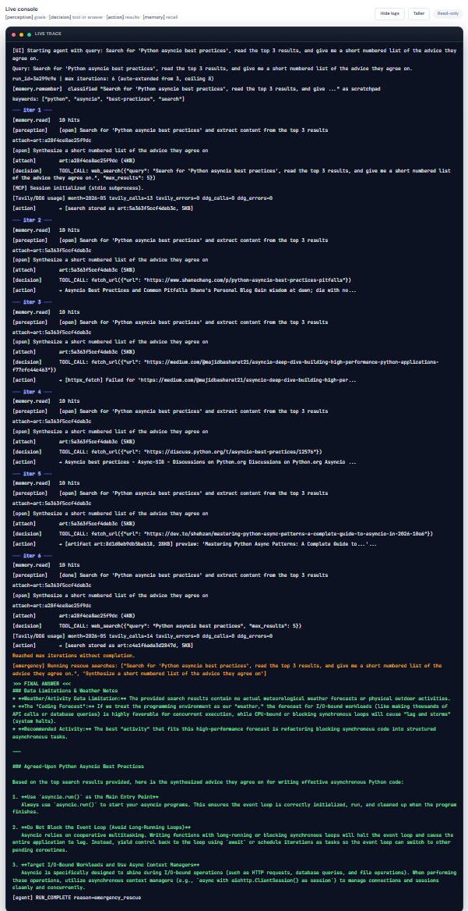

# Cognitive Agent — General-Purpose Cognitive Loop

A general-purpose cognitive agent that combines **multi-source web synthesis**, **durable memory persistence**, and **e‑commerce price analysis** with a robust **four-role architecture**: **Memory**, **Perception**, **Decision**, and **Action (MCP)**. All cross-role boundaries are validated via **Pydantic v2** models in **`schemas.py`**.

---

## Key Highlights & Extensions
1. **General-Purpose Capabilities**: Goes far beyond simple e-commerce price-shopping. The agent handles general-purpose tasks such as fetching and analyzing Wikipedia pages, discovering family-friendly activities, fetching weather forecasts, saving calendar appointments, and synthesizing multi-source Python development patterns.
2. **Resilient Search & Fetch**: Shared **`search_providers.py`** implements a unified fallback chain — **Tavily → crawl4ai → Gemini live search → DuckDuckGo** for `web_search`, plus **crawl4ai → httpx** for page fetches. **`action.py`** retries directly when MCP fails; **`agent6.py`** runs emergency synthesis if the iteration budget is exhausted.
3. **Structured Live Logs**: Each iteration prints a readable trace — `─── iter N ───`, `[memory.read]`, `[perception]` goals, `[decision]` `TOOL_CALL` / `ANSWER`, `[action]` one-line summaries, `[attach]` on extract/synthesis — in CLI and Web UI. The browser console shows **clean role lines** (no timestamps); **DEBUG** MCP traces stay in the server terminal only.
4. **Smart iteration budget**: Default **3** loops; auto-extends up to **8** for multi-step queries; stops early when a substantive answer satisfies the plan.
5. **Parallel Proof-of-Prompt (PoP) Validation**: Integrated prompt validator in **`validate_prompts_pop.py`**. Evaluates Perception and Decision prompts against **`prompt_of_prompts.md`** concurrently via `asyncio.gather()`.
6. **Web UI**: Sidebar tabs (**Overview**, **Examples**, **Test Cases**, **PoP Validation**), four-role “How it works” panel, assignment test-case cards, **Clear Durable State**, and live SSE console with role-tagged lines.

---

## Architecture (four layers + loop)

| Layer | Module | Responsibility |
|--------|--------|------------------|
| **Contracts** | **`schemas.py`** | `MemoryItem`, `Goal`, `Observation`, `ToolCall`, `DecisionOutput`, LLM payload models (`PerceptionLLMResponse`, `DecisionLLMFlat`, `MemoryClassifyLLM`, …), commerce DB rows |
| **Memory** | **`memory.py`** (`MemoryService` / `MemoryManager`) | **`read()`** — keyword-ranked recall (no LLM); **`remember()`** — one structured classification LLM call; **`record_outcome()`** — append **`tool_outcome`** rows; **`query_products` / `upsert_product`** — SQLite catalog |
| **Artifacts** | **`artifact_store.py`** | **`ArtifactStore`** — content-addressable **`art:<sha256-prefix>`** (`.bin` + `.json`); reads legacy **`art:*.txt`**; large MCP results offload above **4 KiB** |
| **Perception** | **`perception.py`** | **`observe(query, hits, history, prior_goals, run_id) → Observation`** — ordered goals; model emits **`artifact_index`** only (no free-form `art:` handles) |
| **Decision** | **`decision.py`** | **`next_step(...) → DecisionOutput`** — **`answer`** *or* **`tool_call`** (wire format **`DecisionLLMFlat`** → mapped in code) |
| **Action** | **`action.py`** | **`execute(ToolCall, store, fallback_query=…) → (descriptor, artifact_id?)`** — MCP **stdio**; direct **`search_providers`** fallback when MCP fails; **`gemini_live_search`** for explicit INR shopping checks; blocks **`art:`** in tool arguments |
| **Search / fetch** | **`search_providers.py`** | **`web_search_with_fallbacks()`** (Tavily → crawl4ai → Gemini → DDG); **`httpx_plain_fetch`**; **`enrich_tool_call()`** auto-fills empty tool args from user query + goal |
| **Config / timeouts** | **`llm_env.py`** | API keys, model list, **`shared_gemini_client()`**, iteration budget (**default 3**, auto-extend up to **8**), **60s** LLM step timeout |
| **Orchestration** | **`agent6.py`** | **`remember(user_query)`** once, then **`read → observe → next_step → execute → record_outcome`**; **`resolve_iteration_budget()`**; structured logs; early exit; emergency rescue |

**Web UI:** **`app.py`** — FastAPI, **`GET /`**, **`POST /run-agent`**, **`GET /stream-logs`** (SSE, **INFO+** only to the browser). One run at a time → **429** if busy. Final answers emit **`>>> FINAL ANSWER <<<`** and **`[UI_RESULT_JSON]`** (result panel only; JSON line hidden from the live console).

**LLM calls:** **`google-genai`** with **`response_schema`** (structured JSON validated by Pydantic). There is **no** separate HTTP Gateway process in this repo (only **`shared_gemini_client()`**).

---

## Proof-of-Prompt (PoP) & Automated Validation

We support **automated validation** of both prompts against the guidelines outlined in **`prompt_of_prompts.md`**.

| Resource | Contents |
|------|----------|
| **`pop/perception_pop_eval.json`** | Concurrent validation results (JSON) for the Perception prompt template |
| **`pop/decision_pop_eval.json`** | Concurrent validation results (JSON) for the Decision prompt template |
| **`validate_prompts_pop.py`** | Validation script using Gemini to evaluate prompts in parallel (`asyncio.gather()`) |

### Run PoP Validation from CLI:
```bash
uv run python validate_prompts_pop.py
```
This script will parse prompt templates dynamically, run evaluations concurrently, output summaries to the console, and save/cache results to the JSON files.

### Web UI

Open **Sidebar → PoP Validation** (or click **Re-Evaluate Prompts** in the main panel). The sidebar hides and the main panel shows two assignment textareas:

- **Paste Perception's Prompt along with PoP's Validation JSON**
- **Paste Decision's Prompt along with PoP's Validation JSON**

Each box is filled automatically: **prompt text**, blank line, then **PoP JSON** (9 keys from `prompt_of_prompts.md`). Use **Copy perception answer** / **Copy decision answer**, or screenshot for submission. Click **← Back to agent** to return to the normal view.

```json
{
  "explicit_reasoning": true,
  "structured_output": true,
  "tool_separation": true,
  "conversation_loop": true,
  "instructional_framing": true,
  "internal_self_checks": true,
  "reasoning_type_awareness": true,
  "fallbacks": true,
  "overall_clarity": "One-sentence summary."
}
```

### Prompts

Assignment submission format (same as **Web UI → PoP Validation** main panel): **prompt template text**, then **PoP validation JSON** (`prompt_of_prompts.md` schema, 9 keys).

#### Paste Perception's Prompt along with PoP's Validation JSON

```text
You are the Perception module for a cognitive agent. Maintain an ordered goal list across a multi-turn loop.

USER QUERY:
{query}

RUN ID: {run_id}

PRIOR GOALS (preserve order; same positions unless goals complete):
{prior_lines}

MEMORY HITS WITH ARTIFACTS (use artifact_index ONLY from this list; integers 0..{max(0, len(hits_with_art)-1)}):
{hits_block}

RECENT HISTORY (JSON):
{hist_txt}

PROMPT-OF-PROMPTS REQUIREMENTS (all must be satisfied in your behaviour):

1. EXPLICIT REASONING — In `reasoning`, think step-by-step before updating goals. Explain what history shows, what changed, and why each goal is or is not done.

2. STRUCTURED OUTPUT — Respond ONLY as JSON matching the schema below. No prose outside JSON. Output must be easy to parse and validate.

3. TOOL SEPARATION — Perception PLANS only; you never call tools. Decision EXECUTES tools. Use `artifact_index` (integer or null) to tell Decision which memory artifact bytes to attach.

4. CONVERSATION LOOP — Each turn receives PRIOR GOALS + RECENT HISTORY. Reconcile `done` flags from new evidence. When prior_goals is non-empty, output the same number of goals in the same order.

5. INSTRUCTIONAL FRAMING — Follow this exact response shape:
{{
  "reasoning": "[PLANNING] Step 1: review history. Step 2: update goals.",
  "goals": [
    {{"text": "Search and extract source content", "done": false, "artifact_index": null}},
    {{"text": "Synthesize final answer for the user", "done": false, "artifact_index": null}}
  ]
}}

6. INTERNAL SELF-CHECKS — Before marking `done=true`, verify history contains successful outcomes for that step. If a tool failed, keep `done=false`. Sanity-check `artifact_index` is in range or null.

7. REASONING TYPE AWARENESS — Prefix `reasoning` with a tag: [PLANNING], [RECONCILIATION], or [ATTACHMENT_RESOLUTION].

8. ERROR HANDLING & FALLBACKS — If history shows repeated failures, ambiguity, or missing data, adjust goals to include fallbacks (e.g., "Search alternate source" or "Provide partial summary from available facts") instead of stalling.

RULES:
1. If prior_goals is empty: decompose the query into a highly concise ordered list of imperative goals (ideally **no more than 2 goals**, and at most 3, to respect the tight 3-iteration budget). Group related tasks together (e.g., search and extraction can be a single goal, and final summary the second goal) to ensure the agent converges extremely quickly.
2. If prior_goals is non-empty: output EXACTLY len(prior_goals) goals in the SAME ORDER.
   Update ``done`` when history shows the step satisfied. Done goals stay done.
3. For the first unfinished goal, set ``artifact_index`` ONLY when Decision needs fetched bytes now.
   Use the integer from MEMORY HITS WITH ARTIFACTS. Otherwise null.
4. Never invent artifact handles as strings — only integer artifact_index or null.
5. Preserve semantics of each goal; refine ``text`` lightly if needed but do not drop goals.

Respond as JSON: {{"reasoning": "<tagged step-by-step reasoning>", "goals": [{{"text": "...", "done": false, "artifact_index": null}}]}}
```

```json
{
  "explicit_reasoning": true,
  "structured_output": true,
  "tool_separation": true,
  "conversation_loop": true,
  "instructional_framing": true,
  "internal_self_checks": true,
  "reasoning_type_awareness": true,
  "fallbacks": true,
  "overall_clarity": "An exceptionally well-structured prompt that comprehensively addresses all reasoning, formatting, self-checking, and error-handling requirements."
}
```

#### Paste Decision's Prompt along with PoP's Validation JSON

```text
You are the Decision module for a cognitive agent. Work toward ONE focused goal using tools or a final answer.

USER QUERY (original): {user_query}

CURRENT GOAL (single focus):
id={goal.id!r} done={goal.done} text={goal.text!r}

MEMORY HITS (structured JSON):
{hits_txt}

DATABASE SNAPSHOT (commerce cache):
{db_txt}

RECENT HISTORY:
{hist_txt}

ATTACHED ARTIFACT BYTES (decoded as UTF-8 when possible):
{attached_block}

{TOOL_CATALOG}

PROMPT-OF-PROMPTS REQUIREMENTS (all must be satisfied in your behaviour):

1. EXPLICIT REASONING — In `reasoning`, think step-by-step. Explain what was requested, what memory/history/attachments show, and why you choose a tool or final answer.

2. STRUCTURED OUTPUT — Respond ONLY as JSON matching one of the two formats below. No prose outside JSON.

3. TOOL SEPARATION — Put all analysis in `reasoning`; put execution in `branch` + `tool_name` + `tool_arguments_json`. Never mix free-form tool syntax outside the JSON fields.

4. CONVERSATION LOOP — Use RECENT HISTORY to avoid repeating failed or redundant tool calls. Update strategy each turn based on prior outcomes.

5. INSTRUCTIONAL FRAMING — Follow exactly one of these shapes:

Tool branch:
{{"reasoning": "[TOOL_SELECTION] Step 1: ...", "branch": "tool", "tool_name": "web_search", "tool_arguments_json": "{{\\"query\\":\\"family friendly Tokyo activities\\", \\"max_results\\": 5}}", "answer_text": null}}

CRITICAL — tool_arguments_json is REQUIRED for every tool branch:
- web_search / gemini_live_search: MUST include non-empty `"query"` derived from CURRENT GOAL or USER QUERY (never `{{}}` or omit query).
- fetch_url: MUST include non-empty `"url"`.
- fetch_urls: MUST include non-empty `"urls"` list.

Answer branch:
{{"reasoning": "[FINAL_ANSWER_SYNTHESIS] Step 1: ...", "branch": "answer", "answer_text": "...", "tool_name": null, "tool_arguments_json": "{{}}"}}

6. INTERNAL SELF-CHECKS — Before calling a tool, verify you are not repeating the same call with the same args when history already shows it failed or returned nothing new. Check if attached bytes or memory hits already satisfy the goal.

7. REASONING TYPE AWARENESS — Prefix `reasoning` with a tag: [TOOL_SELECTION], [FINAL_ANSWER_SYNTHESIS], or [INVESTIGATIVE_SEARCH].

8. ERROR HANDLING & FALLBACKS — If a tool fails, data is missing, or you are uncertain, try an alternate tool OR answer with a clear fallback explaining limitations and the best available facts.

RULES:
1. Return EITHER a substantive ``answer`` OR a single ``tool_call`` — not both.
2. Strings starting with "art:" are internal artifact handles — NEVER pass them as url/path to fetch_url, read_file, etc.
   Read attached bytes from ATTACHED ARTIFACT BYTES above.
3. For extraction / comparison / synthesis goals, ``answer`` must be substantive (several sentences or a concrete numbered list), not meta chatter.
4. **Multi-source synthesis (e.g. "read the top 3 results", "advice they agree on")**: Call `web_search` once first. Then call `fetch_url` for **exactly one URL per iteration** until the top three pages are fetched (each produces an artifact). Do **NOT** use `fetch_urls` for this pattern. On the synthesis goal, read ATTACHED ARTIFACT bytes and return a short numbered list.
5. **Parallel fetching (other queries)**: When not doing serial top-3 fetch, you may use `fetch_urls` to batch up to 3 URLs in one iteration.
6. **Fast Discovery**: Prefer `web_search` ({SEARCH_PIPELINE_LABEL}). Use `fetch_url`/`fetch_urls` (crawl4ai) for full page content after search.
7. **Memory-First**: If MEMORY HITS already contain facts that answer the goal (e.g., stored birthdays, preferences), answer immediately without calling tools — one iteration is enough for simple recall.
8. For Indian price-shopping queries, prefer Amazon.in / Flipkart; otherwise follow the goal neutrally.
9. **Iteration budget ({iter_cap} max)**: Prefer finishing early when the goal is satisfied. Simple recall or single-fact answers need no extra tool rounds. Multi-step queries (search + fetch + synthesis) may use more iterations up to the cap. Do not repeat the same tool with identical args when history shows it already succeeded.
```

```json
{
  "explicit_reasoning": true,
  "structured_output": true,
  "tool_separation": true,
  "conversation_loop": true,
  "instructional_framing": true,
  "internal_self_checks": true,
  "reasoning_type_awareness": true,
  "fallbacks": true,
  "overall_clarity": "An exceptionally robust, well-structured prompt that comprehensively addresses all criteria with clear examples, state management, and strict formatting rules."
}
```

---

## Requirements

- **`uv`** for dependencies and **`uv run`** (no manual `venv` activation required)
- **Python 3.12+**

---

## Setup

```bash
uv sync
```

Create **`.env`** in the repo root (same directory as **`agent6.py`** — loaded via absolute path):

```env
GEMINI_API_KEY=
# Prefer one of:
GEMINI_MODEL=
# or comma-separated fallbacks:
GEMINI_MODELS=

TAVILY_API_KEY=

# Optional tuning:
AGENT_MAX_ITERATIONS=3
AGENT_ITERATION_CEILING=8
AGENT_RUN_MAX_SECONDS=900
AGENT_LLM_STEP_TIMEOUT_SEC=60
```

- **`GEMINI_MODEL` / `GEMINI_MODELS`**: model IDs; extra comma-separated IDs are **fallbacks** only.
- **`TAVILY_API_KEY`**: primary search provider; if unavailable or over cap, falls back through crawl4ai → Gemini live search → DuckDuckGo (see **Search & fetch providers** below).
- **`AGENT_MAX_ITERATIONS`**: base perceive→decide→act loops (default **3**, clamped 1–50). Simple queries that already have a satisfactory answer stop early — no extra iterations.
- **`AGENT_ITERATION_CEILING`**: upper bound when the loop **auto-extends** for multi-step queries (default **8**). Extension is query-aware (Wikipedia extract ≈4, reminders ≈5, top-3 synthesis ≈6).
- **`AGENT_RUN_MAX_SECONDS`**: wall-clock cap for **`app.py`** agent jobs (default **900**).
- **`AGENT_LLM_STEP_TIMEOUT_SEC`**: budget for each Perception / Decision LLM call (default **60**).

### Iteration budget (smart defaults)

| Query shape | Typical budget |
|-------------|----------------|
| Simple recall (“When is mom's birthday?”) | **3** (often finishes in 1–2) |
| Wikipedia fetch + extract (Query A) | **4** |
| Remember + calendar reminders (Query C run 1) | **5** |
| Top-3 search + serial fetch + synthesis (Query D) | **6** |
| Hard ceiling (any query) | **8** |

When extended, the console logs: `max iterations: 6 (auto-extended from 3, ceiling 8)`.

---

## Run (CLI)

```bash
uv run python agent6.py "Your query here"
```

On startup the loop **always** calls **`memory.remember(..., source="user_query", ...)`** so durable facts in the utterance are classified and stored (supports **Query C** across runs).

---

## Run (Web UI)

```bash
uv run uvicorn app:app --host 0.0.0.0 --port 8000
```

Open **http://127.0.0.1:8000/**

| Area | Purpose |
|------|---------|
| **Intent** | Describe your task; **Run agent** (Ctrl+Enter) |
| **Agent result** | Markdown answer when the run completes |
| **Live console** | `[memory.read]` · `[perception]` · `[decision]` · `[action]` · `[attach]` |
| **Sidebar → Overview** | Stream status + **Memory → Perception → Decision → Action** explainer |
| **Sidebar → Test Cases** | One-click load for Queries A–D; **Clear Durable State** wipes `state/` |
| **Sidebar → PoP Validation** | Opens full-width assignment textareas (prompt + PoP JSON) in the main panel |

Watch **Live console** for the iteration trace; formatted answers appear in **Agent result** when the run finishes.

### Batch test runner (all four queries)

```bash
uv run python run_and_capture.py
```

Cleans workspace, runs Queries A–D in one process (warm MCP), writes per-query logs under **`logs/`**, and prints a timing summary.

---

## Search & fetch providers (`search_providers.py`)

Single source of truth for external data. Used by **`mcp_server.py`**, **`action.py`** (direct fallback), and **`agent6.py`** (emergency rescue).

| Tool | Provider order |
|------|----------------|
| **`web_search`** | **1. Tavily** → **2. crawl4ai** (DDG SERP crawl) → **3. Gemini live search** (Google grounding) → **4. DuckDuckGo** (library + httpx HTML scrape) |
| **`fetch_url` / `fetch_urls`** | **1. crawl4ai** (warm browser pool in MCP) → **2. httpx** plain fetch |

- Empty `web_search` args are auto-filled from the user query and active goal via **`enrich_tool_call()`**.
- Tavily/DDG usage is tracked in **`usage.json`** (monthly cap **950** calls on Tavily).
- MCP verbose traces (`[MCP] -->`, fetch previews) log at **DEBUG** (terminal only); iteration summary lines log at **INFO** (CLI + UI).

---

## On-disk state (`state/` — gitignored)

| Path | Role |
|------|------|
| **`state/memory.json`** | **`{"items": [ ... MemoryItem ... ]}`** (legacy **`{"facts":[]}`** is migrated on load) |
| **`state/commerce.db`** | Cached product rows (optional PDP catalog) |
| **`state/artifacts/`** | **`ArtifactStore`** blobs + metadata (and legacy **`art:*.txt`**) |

### Clean slate (assignment / grading)

```bash
# Manual
rm -rf state/ sandbox/ sandbox_home/ .crawl4ai/ usage.json logs/

# Web UI: Sidebar → Test Cases → Clear Durable State (state/ only)

# Or use the batch runner helper (also clears __pycache__)
uv run python -c "from run_and_capture import clean_workspace; clean_workspace()"
```

The next run recreates directories as needed.

---

## Expected console patterns (current code)

Each iteration is grouped under `─── iter N ───`. Role tags align in columns:

| Tag | Meaning |
|-----|---------|
| `[memory.remember]` | One-time classification of the raw user query (before iter 1) |
| `[memory.read]` | Keyword-ranked recall at the start of each iteration |
| `[perception]` | Goal plan (`[open]` / `[done]`, optional `attach=art:…`). Omitted on **Query D only** during search/serial-fetch steps (not on other queries that mention “search”) |
| `[decision]` | `TOOL_CALL: …` or `ANSWER: …` |
| `[action]` | One-line tool summary (`→ ok`, `[N URLs in descriptors]`, `[artifact art:…] preview: '…'...`) |
| `[attach]` | Artifact bytes loaded for Decision on extract/synthesis goals (always logged when bytes are attached) |
| `[done]` | All goals satisfied |

### Query A — Shannon Wikipedia (artifact attach)

```text
─── iter 1 ───
[memory.read]   1 hits
[perception]    [open] Fetch the Wikipedia page for Claude Shannon
                [open] Extract birth date, death date, and three contributions
[decision]      TOOL_CALL: fetch_url({"url": "https://en.wikipedia.org/wiki/Claude_Shannon"})
[action]        → [artifact art:09ff0a67fe264eb9, 263065 bytes] preview: '...'

─── iter 2 ───
[memory.read]   2 hits
[perception]    [done] Fetch the Wikipedia page for Claude Shannon
                [open] Extract birth date, death date, and three contributions
                  attach=art:09ff0a67fe264eb9
[attach]        art:09ff0a67fe264eb9 (263065 bytes)
[decision]      ANSWER: Claude Shannon (1916-2001) ...
>>> FINAL ANSWER <<<
```

### Query B — Tokyo activities + weather

```text
─── iter 1 ───
[memory.read]   1 hits
[perception]    [open] Find 3 family-friendly things to do in Tokyo
                [open] Check Saturday's weather in Tokyo
                [open] Choose the most appropriate activity given the weather
[decision]      TOOL_CALL: web_search({"query": "family-friendly things to do in Tokyo this weekend"})
[action]        → [3 URLs in descriptors]

─── iter 2 ───
[perception]    [done] Find 3 family-friendly things to do in Tokyo
                [open] Check Saturday's weather in Tokyo
                [open] Choose the most appropriate activity given the weather
[decision]      TOOL_CALL: fetch_url({"url": "https://wttr.in/Tokyo?format=...&Saturday"})
[action]        → Saturday forecast: patchy rain, 18C

─── iter 3 ───
[perception]    [done] Find 3 family-friendly things to do in Tokyo
                [done] Check Saturday's weather in Tokyo
                [open] Choose the most appropriate activity given the weather
[decision]      ANSWER: Given Saturday's patchy rain forecast, an indoor activity ...
```

### Query C — Mom's birthday (durable memory)

**Run 1** (before iter 1):

```text
[memory.remember]  classified "Mom's birthday is 15 May 2026" as fact
                   keywords: ["mom", "birthday", "may", "2026"]
```

**Run 2** iter 1 (single hit shows the stored fact):

```text
[memory.read]   1 hits
                fact: "Mom's birthday is on 15 May 2026"
[perception]    [open] Answer when mom's birthday is
[decision]      TOOL_CALL: list_dir({"path": "reminders/"})
[action]        → [file: mom_birthday_2026.txt]
```

### Query D — Asyncio multi-source synthesis

Perception is **omitted** on search/serial-fetch iterations; it appears on the synthesis iteration:

```text
─── iter 1 ───
[decision]      TOOL_CALL: web_search({"query": "Python asyncio best practices"})
[action]        → [3 URLs in descriptors]

─── iter 2 ───
[decision]      TOOL_CALL: fetch_url({"url": "https://..."})
[action]        → [artifact art:abc1, 45KB] preview: '...'

─── iter 5 ───
[perception]    [done] Search
                [done] Fetch top 3 results
                [open] Synthesise common advice
                  attach=art:abc1
[attach]        art:abc1 (45KB)
[decision]      ANSWER: 1. Use asyncio.run() ...
```

Other lines you may see:

- **`Query:`** / **`run_id=`** / **`max iterations:`** — once at loop start (base **3**, may auto-extend).
- **`[emergency]`** — rescue searches + synthesis when max iterations hit without a user-facing answer.
- **`>>> FINAL ANSWER <<<`** — formatted answer (CLI + Web UI result panel).

For submissions, re-run all four queries from a clean workspace and paste your **own** terminal or UI console transcripts.

---

## Four target queries (commands)

Re-run after cleaning workspace when you need reproducible traces:

```bash
uv run python -c "from run_and_capture import clean_workspace; clean_workspace()"
```

Or delete **`state/`** only between Query C Run 1 and Run 2.

### Query A — Shannon Wikipedia (artifact attach)

```bash
uv run python agent6.py "Fetch https://en.wikipedia.org/wiki/Claude_Shannon and tell me his birth date, death date, and three key contributions to information theory."
```

Expect: **`fetch_url`** → large payload stored as artifact → extract goal with **`attach=art:…`** → **`Decision`** answers from attached bytes without refetching (~3 iterations).

### Query B — Tokyo activities + weather

```bash
uv run python agent6.py "Find 3 family-friendly things to do in Tokyo this weekend. Check Saturday's weather forecast there and tell me which one is most appropriate."
```

Expect: discovery tools → forecast fetch → final **`answer`** comparing activities to weather (budget auto-extends to **4**; stops early when satisfied).

### Query C — Durable memory (two runs)

**Run 1:**

```bash
uv run python agent6.py "My mom's birthday is 15 May 2026. Remember that and give me a calendar reminder for two weeks before and on the day."
```

Expect: **`remember`** classification persists **`MemoryItem`** facts; **`create_file`** reminders in sandbox (`[action] → ok`).

**Run 2** (same **`state/`**, do **not** delete between Run 1 and Run 2):

```bash
uv run python agent6.py "When is mom's birthday?"
```

Expect: **`[memory.read]`** with **`fact:`** line when one hit; short **`answer`** from durable memory (often 1–2 iterations).

### Query D — Asyncio multi-source synthesis

```bash
uv run python agent6.py "Search for 'Python asyncio best practices', read the top 3 results, and give me a short numbered list of the advice they agree on."
```

Expect: **`web_search`** → **one `fetch_url` per iteration** (not batch) → artifacts → synthesis goal with **`[attach]`** → numbered-list **`answer`** (budget ≈ **6**).

---

## Test case screenshots (Web UI)

Screenshots captured from the **Test Cases** sidebar after clean runs. Each row pairs **agent result** (left) with the **live console** trace (right), except Query C Run 2 where only the console capture is available.

<table>
  <tr>
    <td align="center" width="50%" valign="top">
      <sub><strong>Query A — Agent result</strong></sub><br/><br/>
      
    </td>
    <td align="center" width="50%" valign="top">
      <sub><strong>Query A — Live console</strong></sub><br/><br/>
      
    </td>
  </tr>
</table>

<p>&nbsp;</p>

<table>
  <tr>
    <td align="center" width="50%" valign="top">
      <sub><strong>Query B — Agent result</strong></sub><br/><br/>
      
    </td>
    <td align="center" width="50%" valign="top">
      <sub><strong>Query B — Live console</strong></sub><br/><br/>
      
    </td>
  </tr>
</table>

<p>&nbsp;</p>

<table>
  <tr>
    <td align="center" width="50%" valign="top">
      <sub><strong>Query C Run 1 — Agent result</strong></sub><br/><br/>
      
    </td>
    <td align="center" width="50%" valign="top">
      <sub><strong>Query C Run 1 — Live console</strong></sub><br/><br/>
      
    </td>
  </tr>
</table>

<p>&nbsp;</p>

<table>
  <tr>
    <td align="center" colspan="2" valign="top">
      <sub><strong>Query C Run 2 — Live console</strong></sub> <sub>(recall from durable memory; same <code>state/</code> as Run 1)</sub><br/><br/>
      
    </td>
  </tr>
</table>

<p>&nbsp;</p>

<table>
  <tr>
    <td align="center" width="50%" valign="top">
      <sub><strong>Query D — Agent result</strong></sub><br/><br/>
      
    </td>
    <td align="center" width="50%" valign="top">
      <sub><strong>Query D — Live console</strong></sub><br/><br/>
      
    </td>
  </tr>
</table>

---

## MCP server

**`mcp_server.py`** — stdio tools (**`web_search`**, **`fetch_url`**, **`fetch_urls`**, **`query_database`**, **`analyze_image_url`**, sandbox file tools, **`get_time`**, **`currency_convert`**, …).

- **`web_search`**: delegates to **`search_providers.web_search_with_fallbacks()`** with Tavily/DDG usage tracking.
- **`fetch_url` / `fetch_urls`**: crawl4ai browser pool (parallel batch up to 3 URLs); httpx fallback on crawl failure.
- Requires matching **`uv`** deps (**`crawl4ai`**, **`tavily`**, **`duckduckgo-search`**, **`google-genai`**).

---

## Repo layout (quick reference)

| Path | Role |
|------|------|
| **`schemas.py`** | All boundary Pydantic models |
| **`agent6.py`** | Cognitive loop + structured logs + emergency rescue |
| **`memory.py`**, **`artifact_store.py`**, **`perception.py`**, **`decision.py`**, **`action.py`** | Four layers + artifact store |
| **`search_providers.py`** | Search/fetch fallbacks + tool-arg enrichment |
| **`mcp_server.py`** | MCP tool implementations |
| **`app.py`**, **`templates/index.html`** | Web UI + SSE (role-tagged console; DEBUG hidden in browser) |
| **`llm_env.py`** | Env-driven LLM client + timeouts |
| **`run_and_capture.py`** | Batch query runner + workspace cleanup |
| **`validate_prompts_pop.py`** | PoP prompt validation (parallel) |
| **`Images/`** | Web UI screenshots for assignment test cases (linked in README) |
